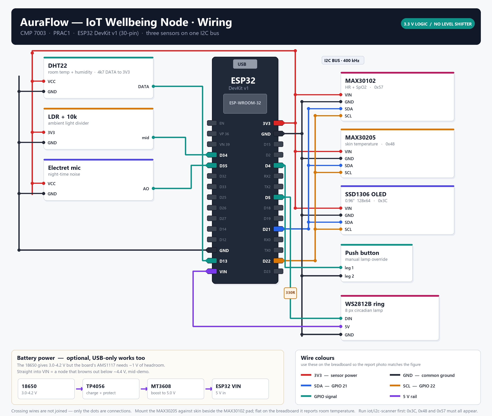

# AuraFlow — IoT Wellbeing Node

**CMP 7003 · PRAC1** — one ESP32 that senses live biometrics, acts as a
circadian lamp, and shows both on its own screen.

> **Why it matters for the marks:** the Huawei Fit exposes no `0x180D` Heart Rate
> GATT service (measured 2026-08-08), so this node is the system's **only live
> biometric stream** — and the independent reference the watch's Health Connect
> samples get validated against in the evaluation section. That validation is a
> real result you can put a number on, which is exactly what §5 wants.

---

## 1. Build it before you wire it

`config.h` carries one simulation switch:

```cpp
#define SIMULATE_BIO 1   // MAX30102
```

With it on, the node synthesises a slow random walk — HR wandering 55–95, SpO₂
94–99 — and publishes it over real WiFi to the real broker. So the whole
**WiFi → MQTT → Laravel → RN app** chain can be built, debugged and demoed with
nothing but a bare ESP32 on the desk.

Set it to `0` the moment the MAX30102 is physically wired in. Debugging a
pipeline bug and a sensor bug at the same time is what eats the days.

> ⚠️ **Every simulated payload carries `"simulated": true`** and the OLED shows a
> `SIM` tag. Filter that field out server-side before anything reaches the
> training set, and never screenshot a `SIM` frame as evidence. Simulated data
> presented as measured data is an academic misconduct finding, not a bug.

## 1b. Before you put a real finger on it

Turning `SIMULATE_BIO` to `0` changes what this project is, legally. A measured
heart rate is personal data, and health data is **special category under GDPR
Art. 9**. Three rules keep that proportionate:

1. **Measure yourself, and only yourself.** The model trains on LifeSnaps and
   PMData, so no participant biometrics are needed for the ML at all. The one
   number the evaluation wants — node HR against the Huawei Fit — is a
   device-agreement measurement that n=1 satisfies. Report n=1 as a limitation
   in §5.4 rather than widening the collection to improve it.

2. **Anyone else means ethics approval first.** A classmate, a sibling, anyone
   who is not you: institutional approval, a participant information sheet and
   written consent, all *before* the first reading. Not retrospectively.

3. **This is not a medical device.** The SpO₂ output is not clinically
   validated. Never present a reading as a diagnostic or as a health finding
   about a person — not in the report, not in the demo, not to whoever is
   holding the sensor.

Full position and the GDPR analysis: `docs/DATASET.md` §8.

## 2. Parts — what this build actually has

| Part | Qty | Feeds |
|---|---|---|
| **ESP32 DevKitC** (38-pin, ESP-WROOM-32) | 1 | everything |
| **MAX30102** breakout, marked `HW-605` | 1 | HR + SpO₂ |
| **SSD1306 0.96" OLED**, 7-pin **SPI** | 1 | local demo readout + lamp state |
| **TP4056** charger | 1 | nothing yet — see *Power* below |
| Breadboard + jumpers | — | — |

The pulse sensor's board marking is `HW-605`, which several vendors list as a
MAX30102 breakout — and its header, `VIN SDA SCL GND` on one edge and
`GND RD IRD INT` on the other, matches. `RD` and `IRD` are internal LED cathode
test points; leave both unconnected. `INT` is unused by this firmware, which
polls the FIFO instead.

> **A marking is not a part number.** MAX30102 and MAX30100 share address `0x57`,
> the same pin names and nearly the same silkscreen, and the node's firmware can
> only drive the former. `../i2c-scanner` reads the part-ID register and prints
> which one you actually have — run it before believing the label.

Also in the box: one 3-pin module silkscreened **`HW-477 v0.2`**. That marking
ships on a linear Hall sensor, on a VS1838B IR receiver and on a two-colour LED
board, so it is **not wired in**. `PIN_SPARE_ADC` (GPIO34) is reserved for it in
`config.h`. Flash `../spare-id` and run the two physical tests in its header —
magnet, then TV remote — to find out which one it is before deciding whether it
earns a place in the build.

### What the original BOM had and this build does not

Being explicit about this matters more than it looks — §5 has to describe the
system that was actually built, and a missing sensor that is simply never
mentioned reads much worse than one whose absence was reasoned about.

| Missing | Cost | What restores it |
|---|---|---|
| **DHT22** | No room temperature or humidity | The part, on GPIO13 |
| **LDR + 10 kΩ** | No ambient light level | The parts, ADC1 divider |
| **Electret mic** | No night-time noise level | The module, ADC1 |
| **MAX30205** | No skin temperature | The part, I²C `0x48` |
| **WS2812B ring** | Lamp has no colour — modes are brightness + motion | The ring + 330 Ω on GPIO5 |
| **18650 + MT3608** | No battery operation | Cell + boost, see *Power* |

Two consequences worth carrying into the report rather than hiding:

1. **The sleep-environment stream is gone.** Worth being precise about what that
   actually costs: the Week 8 model trains on LifeSnaps / PMData and never
   consumed node data, so **no model feature is lost** — `ml/` is untouched by
   this. What is lost is the live room-context half of the "intelligent
   ecosystem" claim: no dark-room wind-down suggestion, no environment card in
   the app, nothing sensed about the space the user is actually in. If that
   claim matters to §4.4, the DHT22 and the LDR are the two cheapest parts on the
   list and between them restore three of the four signals.

2. **No skin temperature — and the MAX30102's on-die sensor is not a substitute.**
   The MAX30102 does expose a temperature register, but it measures its own
   silicon, it exists to compensate the LEDs, and it reads above ambient because
   those LEDs heat it. It is published as `sensor_die_temp_c` on the device topic
   as a diagnostic and is never called a skin or body temperature anywhere in the
   firmware. Do not promote it in the report either.

## 3. Wiring



Full-size figure: `docs/diagrams/03-wiring.jpg`, regenerated with
`python docs/diagrams/generate_wiring.py`. Crossing wires in the figure are not
joined — only the dots are connections.

The board on the bench is the **38-pin DevKitC**, whose header reads:

```
left    3V3  EN  SP  SN  G34 G35 G32 G33 G25 G26 G27 G14 G12 GND G13 SD2 SD3 CMD V5
right   GND  G23 G22 TXD RXD G21 GND G19 G18 G5  G17 G16 G4  G0  G2  G15 SD1 SD0 CLK
```

Every pin this build needs is printed with its own GPIO number, so the labels in
the tables below are literally what you read off the board.

**Power — run the rails first.** `3V3` is the one pin we need that sits on the
*left* header while every signal is on the right, so feed the breadboard rails
once and take both modules' power from there rather than running two wires
around the board:

| ESP32 | goes to |
|---|---|
| `3V3` (left header) | breadboard **+** rail |
| `GND` (right header) | breadboard **−** rail |

**MAX30102 — I²C:**

| From | goes to |
|---|---|
| **+** rail | MAX30102 `VIN` |
| `G21` | MAX30102 `SDA` |
| `G22` | MAX30102 `SCL` |
| **−** rail | MAX30102 `GND` |

**SSD1306 — SPI:**

| From | goes to | note |
|---|---|---|
| **−** rail | OLED `GND` | |
| **+** rail | OLED `VDD` | |
| `G18` | OLED `SCK` | VSPI clock |
| `G23` | OLED `SDA` | **this is MOSI, not I²C data** |
| `G17` | OLED `RES` | |
| `G16` | OLED `DC` | |
| `G5` | OLED `CS` | |

Three traps, in the order people hit them:

- **The OLED's `SDA` pin is SPI MOSI.** It goes to `G23`. Wiring it to `G21`
  beside the pulse sensor's `SDA` is the single most likely mistake here, and it
  fails silently — the pulse sensor keeps working and the screen stays black.
- **Six pins on this board are not yours.** `SD0 SD1 SD2 SD3 CMD CLK` run to the
  SPI flash that holds this firmware. Driving any of them stops the chip booting.
  The 30-pin DevKit v1 simply does not break them out, which is why guides
  written for that board never mention it.
- **GPIO16/17 are not free on an ESP32-WROVER.** They are wired to the PSRAM
  there and the panel will never light. Check the metal can — if it says WROVER
  rather than WROOM, move `DC`/`RES` to `G25`/`G26` in `config.h`.

Both modules are 3.3 V native — **no level shifter**, and the I²C pull-ups are
already on the MAX30102 breakout.

**Nothing else needs a wire.** The lamp is the DevKit's own LED on GPIO2 and the
manual override is its `BOOT` button on GPIO0. This board breaks both out as `G2`
and `G0` — **leave those two header pins empty.** Anything driving `G0` fights
the button, and holding it low at reset drops the chip into download mode.

> If you ever move this to a **30-pin DevKit v1**: the GPIO numbers are all the
> same and the firmware needs no change, but that board prints GPIO16 and GPIO17
> as `RX2` and `TX2` and never shows the numbers at all.

### The lamp, without a WS2812

One monochrome LED cannot carry mode in hue, so the modes are separated by
brightness and by movement instead, and the OLED names the active mode in text
with a brightness bar beside it:

| Mode | LED |
|---|---|
| `off` | dark |
| `focus` | steady, full brightness |
| `break` | slow 4 s breathe — reads as "step away" peripherally |
| `sleep` | steady, capped at 35% however high the app asks |
| `alert` | hard 0.8 s pulse for 6 s, then back to the previous mode |

The MQTT contract did not change, so the app, the Laravel service and the topic
payloads are all untouched. Dropping a ring back in is a change to `light.cpp`
alone.

> ⚠️ **`BOOT` held down through a reset puts the chip in download mode.** That is
> how you flash it, not a fault — just do not hold it through a reset on stage.

### Power

**USB only on this build.** The TP4056 arrived but the 18650 and the MT3608
boost did not, so there is no battery chain to complete: `18650 → TP4056 →
MT3608 (5 V) → ESP32 VIN`.

The boost is not optional if you do add a cell. The 18650 delivers 3.0–4.2 V but
the board's AMS1117 needs ~1 V of headroom, so feeding `VIN` straight from the
cell gives you a node that browns out and reboots below ~4.4 V — mid-demo, on
stage.

## 4. Check the bus first

Flash `../i2c-scanner` before the main sketch, every time the wiring changes:

```
[i2c] expecting exactly one device: 0x57, part id 0x15
[i2c] scanning...
  0x57  MAX3010x pulse oximeter
        part id 0x15  rev 0x03  -> MAX30102, correct part for this build
[i2c] 1 device
```

**One device is a pass.** The OLED is on SPI and will never appear in an I²C
scan. A `part id 0x11` means the breakout is a MAX30100 rather than a MAX30102 —
a different chip needing a different library, which the node firmware does not
carry.

### If the scan finds nothing

Check SDA/SCL and power first, as always. But there is a second cause specific to
these breakouts, and it looks exactly like a wiring fault:

> **Some MAX30102 boards pull SDA and SCL up to their internal 1.8 V rail** rather
> than to `VIN`. The ESP32 needs 2.475 V to read a logic high, so the bus sits
> below threshold and the device never ACKs — the scanner reports an empty bus on
> a module that is perfectly healthy.
>
> **Fix:** add your own 4.7 kΩ from `SDA` to 3V3 and from `SCL` to 3V3 on the
> breadboard. Some newer boards instead carry a solder jumper for 1.8 V / 3.3 V
> logic — check the back before adding resistors.

The scanner prints this as its second suggestion when it finds an empty bus, so
you do not have to remember it at the bench.

The OLED has no equivalent check — SPI has no reply path, so `Display::begin()`
cannot detect a missing panel and only fails on a memory error. If the serial log
says `SSD1306 over SPI` and the screen is still dark, work down the seven-wire
table above; `SDA` on `G21` instead of `G23`, and `G16`/`G17` swapped, are the
usual two.

## 5. Build & flash

1. **Arduino IDE 2.x** → Boards Manager → **esp32 by Espressif**.
2. Library Manager:
   - `PubSubClient` (Nick O'Leary)
   - `ArduinoJson` **v7.x** (Benoit Blanchon) — v6 will not compile, the sketch
     uses the v7 `JsonDocument` API
   - `SparkFun MAX3010x Pulse and Proximity Sensor Library`
   - `Adafruit SSD1306` + `Adafruit GFX Library`

   No NeoPixel and no DHT library any more — those parts are not in this build.
3. `cp secrets.example.h secrets.h`, fill in WiFi + broker + `DEVICE_ID`. On a
   public broker make `DEVICE_ID` unique or a stranger's traffic lands on your
   lamp.
4. No COM port in Device Manager → install the **CP2102** or **CH340** driver,
   depending on the USB chip on your board.
5. **Tools → Partition Scheme → `Huge APP (3MB No OTA/1MB SPIFFS)`.** Not
   optional. WiFi and BLE are both linked in, and the binary is about 1.73 MB —
   the default scheme allows 1.31 MB, so the build fails at the link step with
   `text section exceeds available space in board`. That reads like a code
   problem and is not one.
6. Upload, Serial Monitor at **115200**.

### From the command line

The same build without the IDE, which is also how CI would do it:

```bash
arduino-cli compile --fqbn esp32:esp32:esp32:PartitionScheme=huge_app iot/auraflow-node
arduino-cli upload  --fqbn esp32:esp32:esp32:PartitionScheme=huge_app -p COM8 iot/auraflow-node
```

`arduino-cli` reads the same `Arduino15` data directory the IDE installs into, so
the cores and libraries above are found without installing anything twice.

```
[AuraFlow] IoT wellbeing node
[bio] SIMULATED — MAX30102 not read
[oled] SSD1306 over SPI — sck=18 mosi=23 cs=5 dc=16 res=17
[oled] blank screen from here means wiring, not this line
[warn] simulated sensor data — payloads carry "simulated":true
[wifi] 192.168.1.42  rssi=-51
[mqtt] connecting to broker.hivemq.com:1883 ... connected
```

The sketch targets both Arduino-ESP32 cores: `light.cpp` picks the 3.x pin-based
LEDC API or the 2.x channel-based one at compile time, so whichever board
package is already installed will build.

### Reading the log when nothing seems to happen

With no finger on the sensor the node publishes nothing — correctly, there is
nothing to report — which leaves the log silent in exactly the situation where
someone is asking why. So it prints the idle IR level every five seconds:

```
[bio] no finger — ir=1223 (contact floor 50000)
```

Around **1,200** is an empty sensor working normally. A finger reads six figures.
Anything in between is contact too light to measure. If the number never moves
when you touch the pad, the fault is wiring or the sensor, not the algorithm.

## 6. Topics

| Topic | Direction | Payload |
|---|---|---|
| `auraflow/<id>/light/set` | app → device | `{"mode":"focus","brightness":85}` |
| `auraflow/<id>/light/state` | device → app | `{"mode":"focus","brightness":85,"source":"button","rssi":-52,"uptime_s":410}` *(retained)* |
| `auraflow/<id>/telemetry/device` | device → app | `{"rssi":-52,"ip":"192.168.1.42","uptime_s":410,"heap_free_b":198340,"light_mode":"focus","pulse_sensor":true,"sample_rate_hz":24.97,"dropped_samples":0,...}` every 30 s |
| `auraflow/<id>/telemetry/biometrics` | device → app | `{"finger":true,"settled":true,"hr_bpm":72.4,"hr_bpm_maxim":71,"spo2_pct":97,...}` every 1.5 s while a finger is on |
| `auraflow/<id>/status` | device → app | `online` / `offline` *(retained, Last-Will)* |

> **`telemetry/environment` is gone.** It was renamed to `telemetry/device` and
> its meaning changed with it: it now carries node health, not room conditions.
> Every field in it is something the ESP32 genuinely knows about itself. Anything
> subscribed to the old topic — the Laravel ingest, the app, `mosquitto_sub`
> scripts — needs updating.

Biometrics also publish **once immediately** on finger-on and finger-off, so the
app can show "measuring…" without waiting out the interval.

`sensor_die_temp_c` appears on the device topic only when a reading was possible:
it is skipped while a finger is on the sensor, because the one-shot conversion
blocks long enough to punch a hole in the 25 Hz sample stream.

### `settled`, and why a reading can be flagged valid and still be wrong

The analysis window is four seconds long. For the first two of those after a
finger goes down the buffer is still half no-finger data with a step edge through
the middle of it, and Maxim's peak finder locks onto that edge and returns a rate
inside the plausible range — so it arrives flagged valid, looking exactly like a
real measurement. The same happens in reverse as the finger comes off.

`settled` is false until contact has been unbroken for a whole window. **Ignore
every vital on a frame where it is false**, whatever the validity flags say. The
app's `usableHeartRate()` and `usableSpo2()` already do; anything reading the
broker directly has to as well.

### Two heart rates

| Field | Method | Use it for |
|---|---|---|
| `hr_bpm` | Beat intervals timed against the node's measured sample clock, median filtered | Display, and anything downstream |
| `hr_bpm_maxim` | Maxim's reference algorithm, slew-limited | The evaluation only |

They are published side by side because the reference algorithm divides a whole
number of samples by a whole number of beats and divides that into 1500 — so at
rest it can only ever return 60, 62, 65, 68, 71, 75, 78, 83, 88, 93 or 100 bpm.
It cannot express 73. `iot/analysis/validate_hr.py` reports both against the
watch and against each other; the count of distinct values it prints per
estimator is the quantisation, measured rather than argued.

### `sample_rate_hz` and `dropped_samples`

The SparkFun driver keeps a ring of four samples of its own, and `check()` wraps
its head over the oldest entries without `available()` being able to tell. Four
samples is 160 ms, so any loop iteration longer than that loses signal silently —
and because the rate is a sample count divided into a constant, a window missing
samples reads as a **faster heart** rather than as an error.

The node now detects that gap, discards the window rather than stitching one
across it, and publishes what it has cost. `sample_rate_hz` should sit within a
few hundredths of 25.00; `dropped_samples` climbing during a session means the
loop is stalling and the session is thin. Both are worth a screenshot for the
evaluation — they are the evidence that the readings were taken under a sound
time base rather than merely assumed to be.

## 7. Test without the app

```bash
mosquitto_sub -h broker.hivemq.com -t 'auraflow/auraflow-desk-01/#' -v

mosquitto_pub -h broker.hivemq.com -t 'auraflow/auraflow-desk-01/light/set' \
  -m '{"mode":"focus","brightness":85}'
```

## 8. Evidence to capture

- [ ] I²C scanner output showing `0x57` **and `part id 0x15`** — proves both the
      bus and that the part is a MAX30102, which the report should not assert
      from a board marking alone
- [ ] `mosquitto_sub -v` screenshot: `light/set` → `light/state` round trip
- [ ] `"source":"button"` state message — the bidirectional-control proof
- [ ] `status: offline` after pulling power — Last-Will / resilience
- [ ] Photo of the OLED showing live HR + SpO₂ and the lamp bar, **no `SIM` tag**
- [ ] `telemetry/device` frame with `sample_rate_hz` near 25.00 and
      `dropped_samples: 0` over a full session — the time base the heart rates
      were measured against, rather than the 25 Hz the code assumes
- [ ] `validate_hr.py` output showing the distinct-value count for each
      estimator: the quantisation of the reference algorithm as a measurement
- [ ] Short video of the lamp: `focus` → `break` → `alert`, so the modes read as
      distinguishable without colour. This is the evidence that the WS2812
      substitution still satisfies "IoT actuator", so do not skip it.
- [ ] Node HR vs Huawei Fit HR, same wrist, 20 simultaneous samples → Bland-Altman
      plot (`../analysis/validate_hr.py`). This is the number §5 wants.
      Collect the pairs with `../analysis/session/log_session.ps1` — it logs
      every valid node reading continuously; type the watch's number whenever
      you check it and it pairs and appends to `node_hr.csv` / `watch_hr.csv`.
      Run it across a few short resting sessions (plus one after light
      exercise, so the pairs aren't all clustered at one resting rate) until
      there are 20+ rows, then run `validate_hr.py` on the two CSVs.

      > A bias against the watch is an expected, reportable result, not a bug
      > to chase away — this is a $2 breakout with Maxim's basic reference
      > algorithm against a calibrated commercial wearable. §5.4 should state
      > the measured bias and limits of agreement plainly, the way the
      > dataset's own `docs/DATASET.md` limitations section does elsewhere.
- [ ] Latency: geofence crossing → lamp change, target < 2 s
